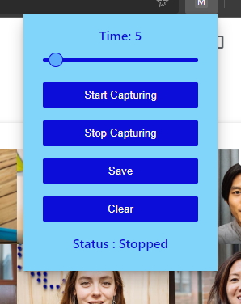

# Meet Attendance

It is a chrome/edge extension that logs attendance during online classes/meetings in Google Meet. It monitors all participants between the set interval and outputs data as an HTML file.

### Features

-   It saves the Attendance log as a HTML file.

-   It also makes muting Audio / Video easier.

-   You can simply press Spacebar to Mute / Unmute Audio and Ctrl + Spacebar to toggle Video.

## Technologies used:

-   JavaScript
-   jQuery
-   HTML
-   CSS

## Screenshots

<kbd>

</kbd>

<kbd>

</kbd>

## Installation

1. Clone the repository.
1. Open the Extension Management page by navigating to chrome://extensions.
   - The Extension Management page can also be opened by clicking on the Chrome menu, hovering over More Tools then selecting Extensions.

1. Enable Developer Mode by clicking the toggle switch next to Developer mode.
   Click the LOAD UNPACKED button and select the extension directory.

1. The extension has been successfully installed. Now Install
   [Google Meet Grid View](https://chrome.google.com/webstore/detail/google-meet-grid-view-fix/dakebdbeofhmlnmjlmhjdmmjmfohiicn) to log all participants data.
